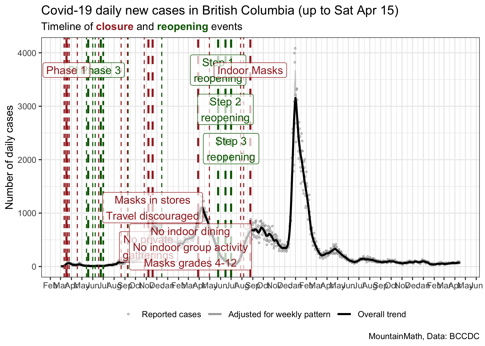
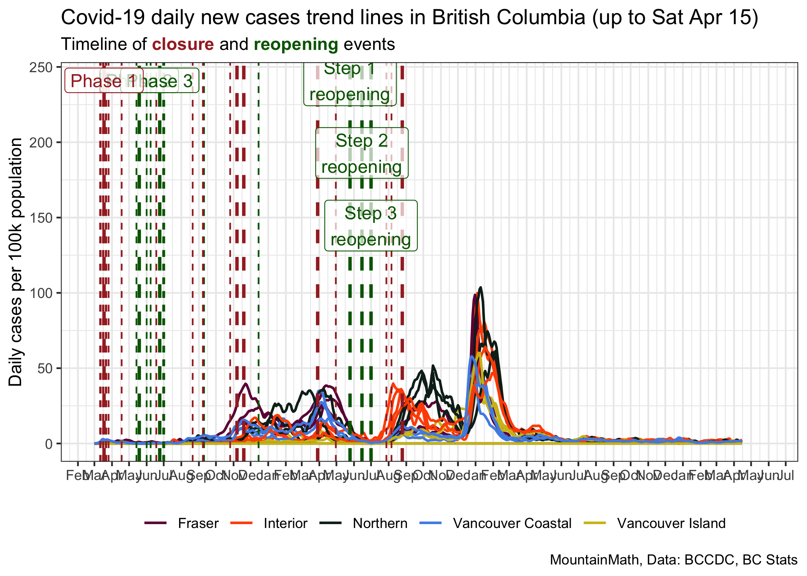
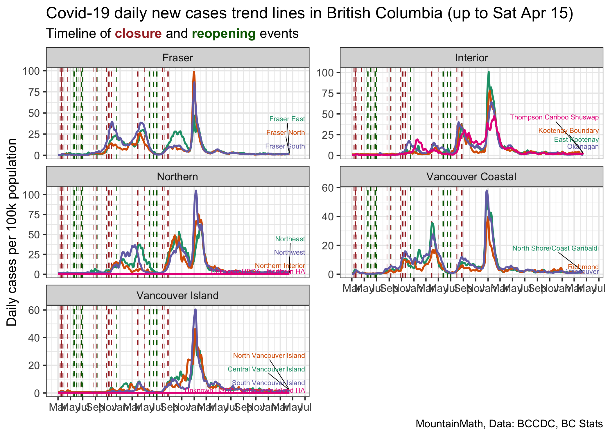
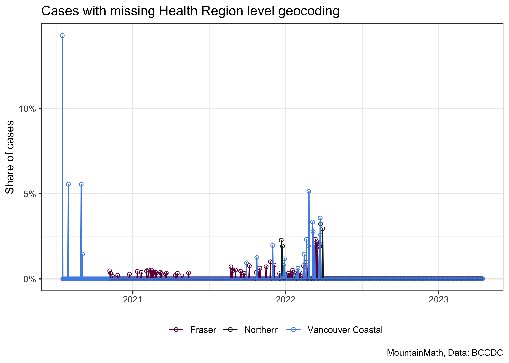

BC Covid Trends
================
Jens von Bergmann
Last updated at 10 May, 2021 - 19:07

This notebook is intended to give a daily overview over BC Covid Trends.
It utilizes a (multiplicative) STL decomposition to esimate a seasonally
adjusted time series controlling for the strong weekly pattern in the
COVID-19 case data and the trend line. For details check the [R notebook
in this GitHub
repo](https://github.com/mountainMath/BCCovidSnippets/blob/main/bc_covid_trends.Rmd).

## Overall BC Trend

## Main Health Authority Trends

## Health Authority Trends

## Health Region Trends

### Age groups

Case incidence by age group.

### Health Region geocoding problems

Health Authorities may lag in geocoding cases to Health Region
geographies, which makes the above Health Region level graph difficult
to interpret. This graph shows the share of cases in each Health
Authority that were geocoded to Health Region geographies.

