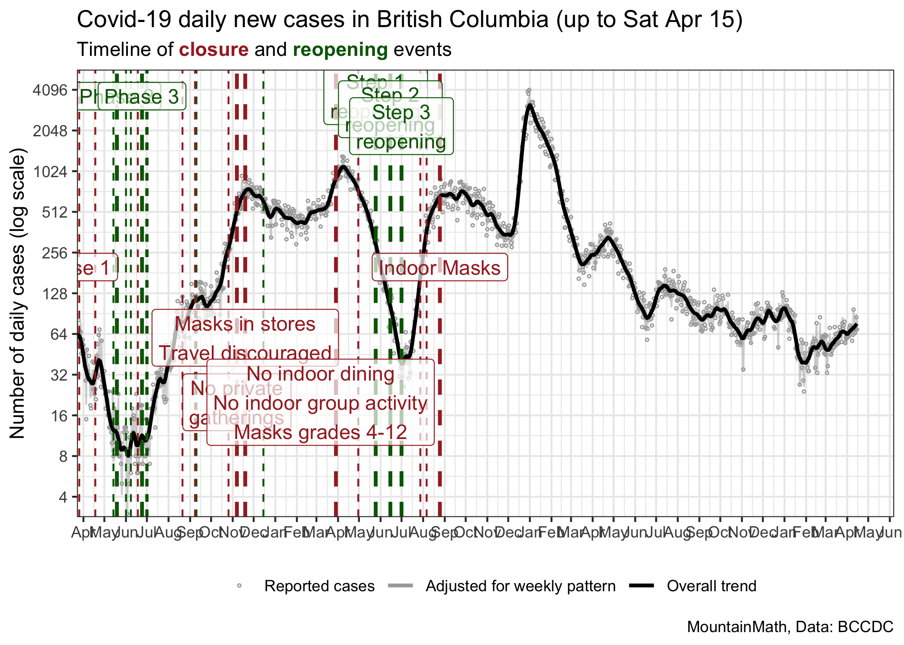
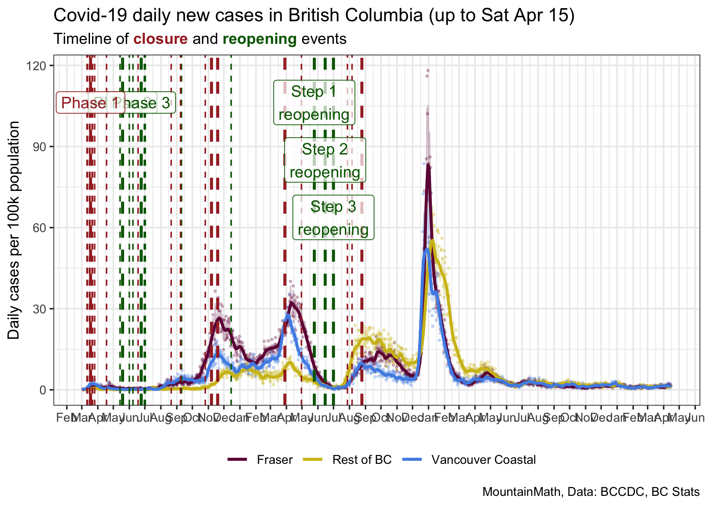
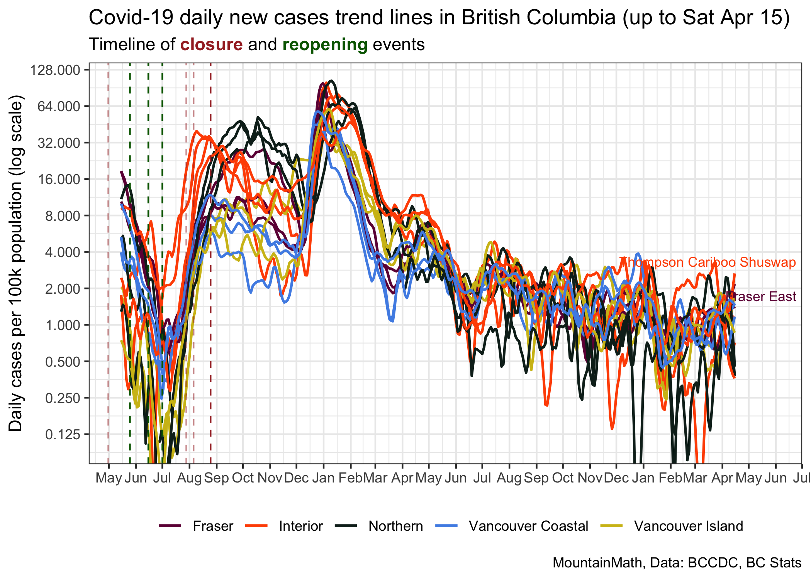
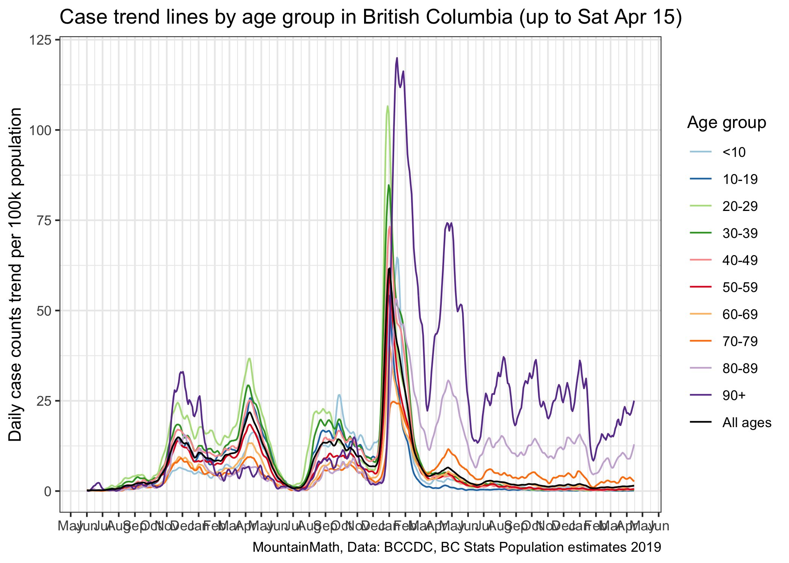
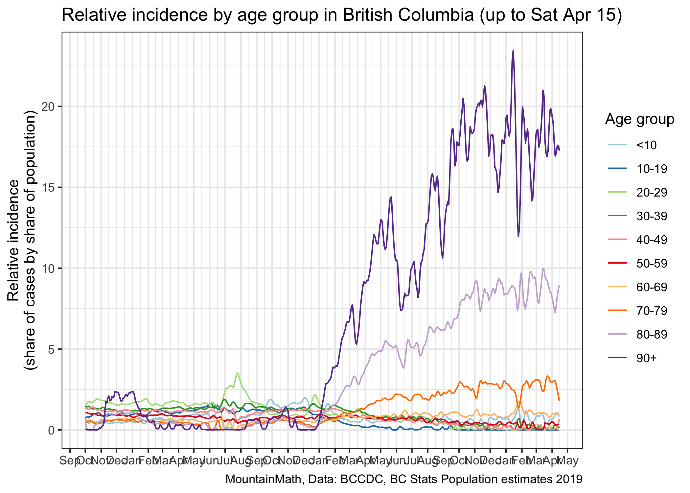

BC Covid Trends
================
Jens von Bergmann
Last updated at 27 October, 2021 - 16:46

This notebook is intended to give a daily overview over BC Covid Trends.
It utilizes a (multiplicative) STL decomposition to esimate a seasonally
adjusted time series controlling for the strong weekly pattern in the
COVID-19 case data and the trend line. For details check the [R notebook
in this GitHub
repo](https://github.com/mountainMath/BCCovidSnippets/blob/main/bc_covid_trends.Rmd).

## Overall BC Trend

## Log scale

The underlying process that generates case data is, to first
approximation, exponential. Plotting cases on a log scale makes it
easier to spot trends.

Real development in case data differs from pure exponential growth in
three important ways:

  - Change in NPI via change regulation or change in behaviour impacts
    the trajectory. In BC behaviour has been generally fairly constant
    over longer time periods, with changes initiated by changes in
    public health regulations. These changes in increase or decrease the
    growth rate. (Growth can be negative or positive.)
  - Increasing vaccinations lead to sub-exponential growth, on a log
    plot the case numbers will bend downward.
  - Changing mix in COVID variants, this will lead to faster than
    exponential growth. When some variants are more transmissibly than
    others and thus incease their share among the cases, the effective
    rate of growth of cases will accelerate and the cases will bend
    upwards on a log plot. This is because each variant should be
    modelled as a separate exponential process, and the sum of
    exponential processes is not an exponential process. In the long
    run, the more transmissible variant will take over and the growth
    rate will follow a simple exponential growth model with growth rate
    given by the more transmissible variant.

## Main Health Authority Trends

## Health Authority Trends

A log plot helps identify trends.

## Health Region Trends

## Recent trends

### Age groups

Case incidence by age group.

### Health Region geocoding problems

Health Authorities may lag in geocoding cases to Health Region
geographies, which makes the above Health Region level graph difficult
to interpret. This graph shows the share of cases in each Health
Authority that were geocoded to Health Region geographies.

