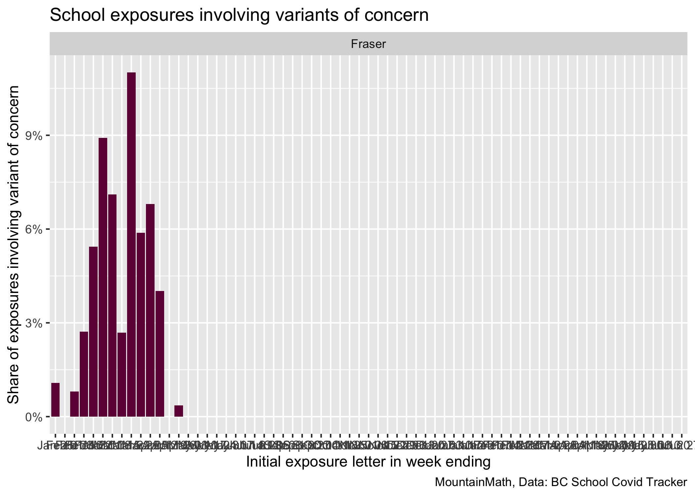
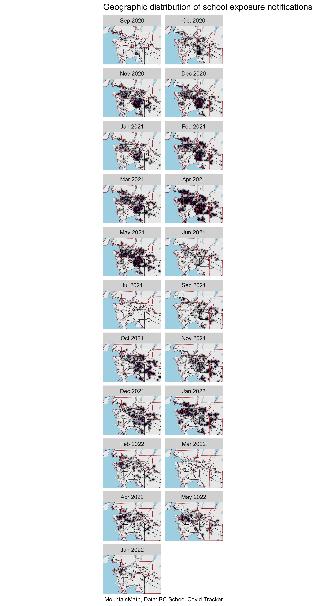

BC School Tracker
================
Jens von Bergmann
Last updated at 03 May, 2022 - 01:19

In BC we don’t have good data on community level COVID cases. But we
can, somewhat cynically, use school exposures as a proxy. The [BC School
Covid Tracker
project](https://bcschoolcovidtracker.knack.com/bc-school-covid-tracker#home/)
has been keeping count of school exposures and meticulously documenting
and geocoding the data. That makes is easy for use to create a heatmap
of school exposures.

The code for this notebook is [available for anyone to adapt and use for
their own
purposes](https://github.com/mountainMath/BCCovidSnippets/blob/main/bc_school_tracker.Rmd).

## Variants of concern

The share of school exposures that are related to variants of concern
can give an indication of the general proliferation of variants of
concern.

We look at the share of school exposures involving variants of concern
for each week, where we split the week between Monday and Tuesday as
exposure notifications coming out on Monday usually relate to exposures
in the preceding week. Variant of concern screening takes some extra
time and exposures might get identified as realting to variants of
concern a couple of days later, so shares in the most recent week (and
sometimes also the week before that) may rise as exposures gets updated.
In particular, the lag will bias the share of exposures involving
variants of concern in the current week downward.

Shares are computed separately for each Health Authority, we only show
Health Authorities that have flagged exposure events as relating to
variants of concern.

## School Exposure Heat Map

This data is not normalized by population, so it should be viewd in
context of the school aged (5-17yo) population further down.

## Monthly exposure density

Looking at monthly school exposure denisty gives us some sense of how
the distribution of exposure notifications has changed over time. The
last month only has partial data and the heat map will appear to have
lower values in comparison until the month is complete..

## Children density heat map for comparison

