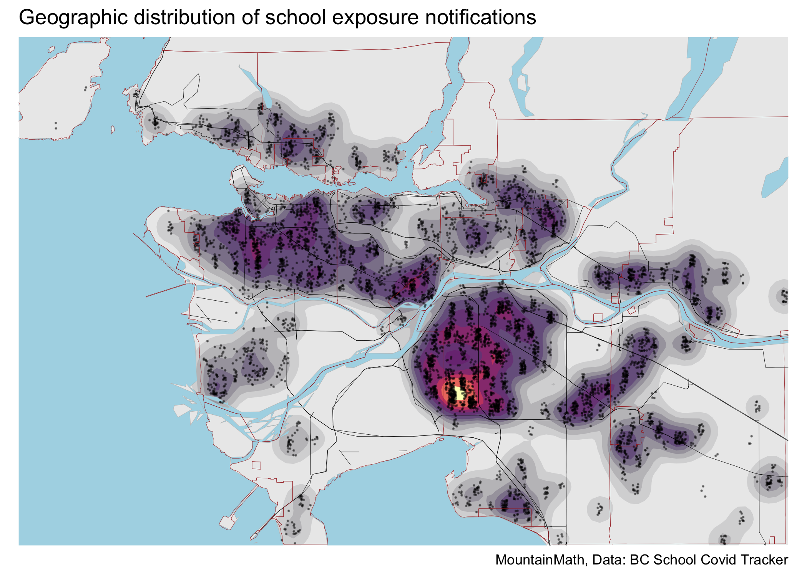
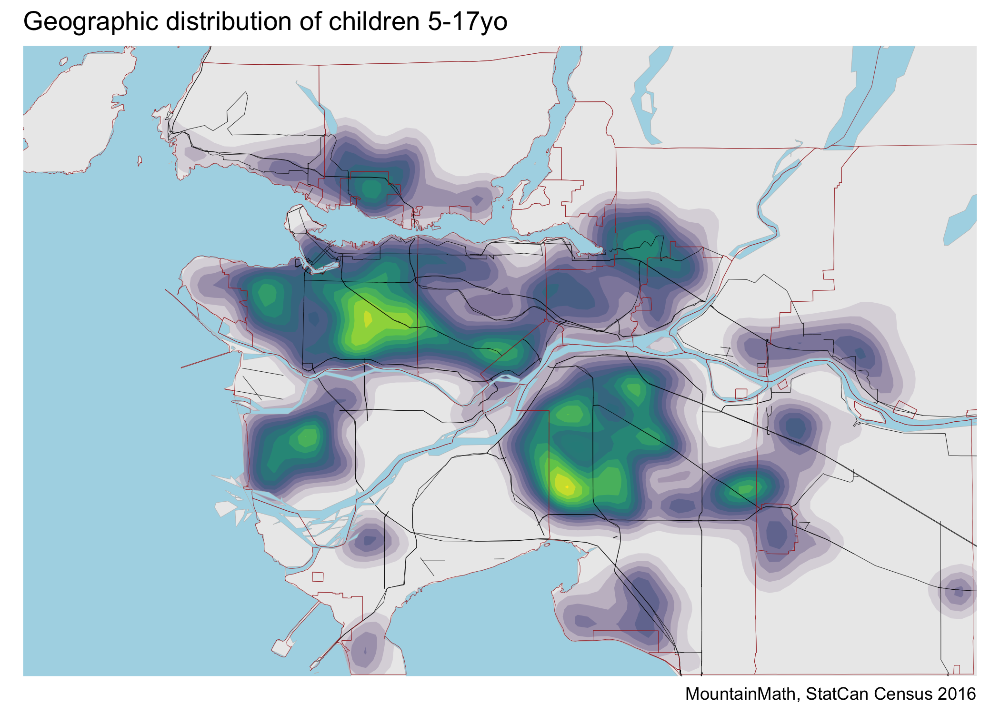

BC School Tracker
================
Jens von Bergmann
Last updated at 19 January, 2021 - 16:37

In BC we don’t have good data on community level COVID cases. But we
can, somewhat cynically, use school exposures as a proxy. The [BC School
Covid Tracker
project](https://bcschoolcovidtracker.knack.com/bc-school-covid-tracker#home/)
has been keeping count of school exposures and meticulously documenting
and geocoding the data. That makes is easy for use to create a heatmap
of school exposures.

However, this data is not normalized by population, so it should be
viewd in context of the school aged (5-17yo) population further down.

## School Exposure Heat Map

## Children density heat map for comparison

