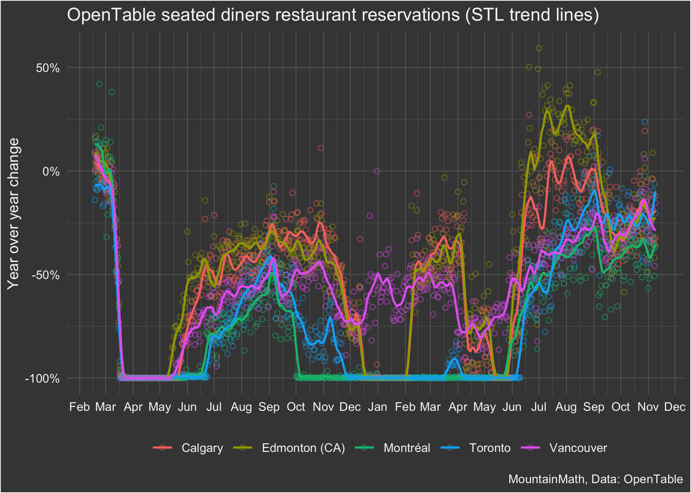
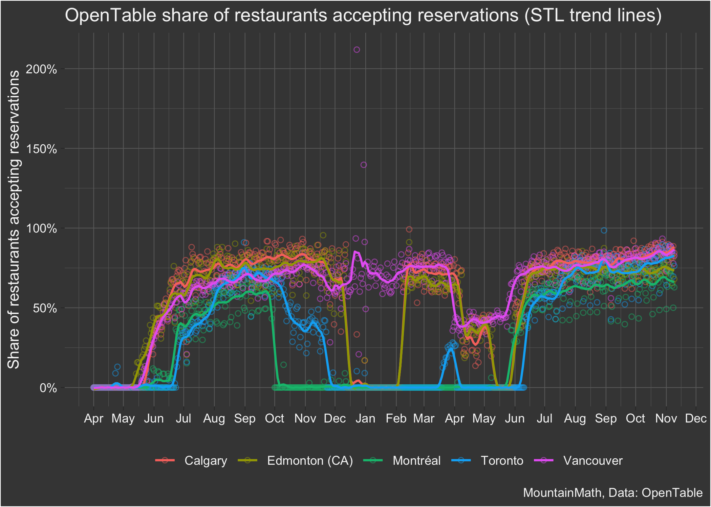

Open Table
================
Jens von Bergmann
Last updated at 31 October, 2021 - 16:46

These graphs show Open Table year over year change in reservations for
seated diners and share of restaurants that accept reservations from the
[Open Table State of the industry
report](https://www.opentable.com/state-of-industry). The code for this
notebook is [available for anyone to adapt and use for their own
purposes](https://github.com/mountainMath/BCCovidSnippets/blob/main/open_table.Rmd).

## Seated diners from online, phone, and walk-in reservations

## Restaurants open for reservations

