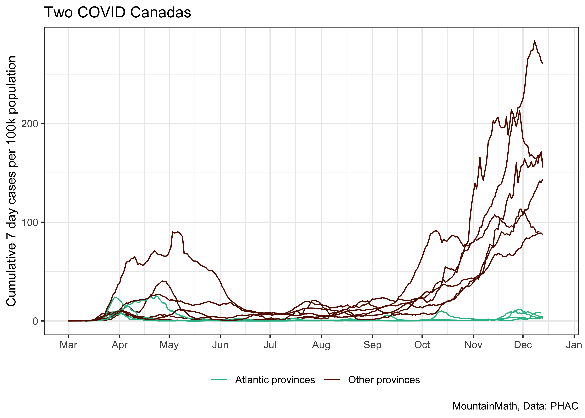

Two Covid Canadas
================
Jens von Bergmann
Last updated at 14 December, 2020 - 07:50

The Atlantic provinces have pursued very different COVID-19 strategies
from the other provinces and have seen very different outcomes.

For better comparison we can plot the Atlantic provinces and the other
provinces on different scales.

