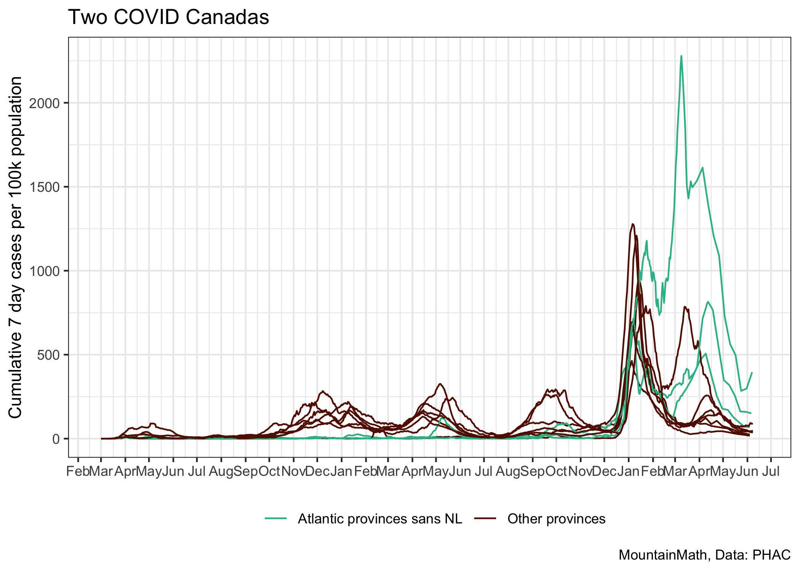
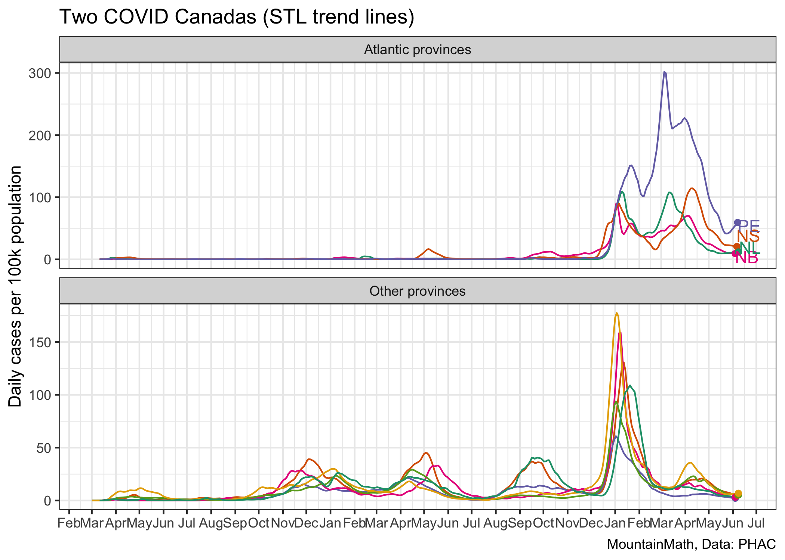

Two Covid Canadas
================
Jens von Bergmann
Last updated at 01 November, 2021 - 16:46

This notebook shows the confirmed COVID cases for Canadian provinces.
The code for this notebook is [available for anyone to adapt and use for
their own
purposes](https://github.com/mountainMath/BCCovidSnippets/blob/main/two_covid_canadas.Rmd).

The Atlantic provinces have pursued very different COVID-19 strategies
from the other provinces and have seen very different outcomes. The
7-day incidence, that is the cumulative number of cases over the past 7
days per 100,000 population, has been used by many jurisdictions as a
key metric to trigger policy interventions.

For better comparison we can plot the Atlantic provinces and the other
provinces on different scales.

## Trend lines

Sometimes it is useful to get a clearer view on trend lines. Rolling
7-day sums (like above) or rolling averages (as often emplyed) are a
problematic way to represent trend lines as the lag actual trends by 3
days.

A fairly simple trend line model like a (multiplicative) STL
decomposition can extract cleaner trend lines that also cover the most
recent 3 days of data, at the expense of a bit of added volatility at
the very end of the trend line where the trend line may shift slightly
when new data comes in.

