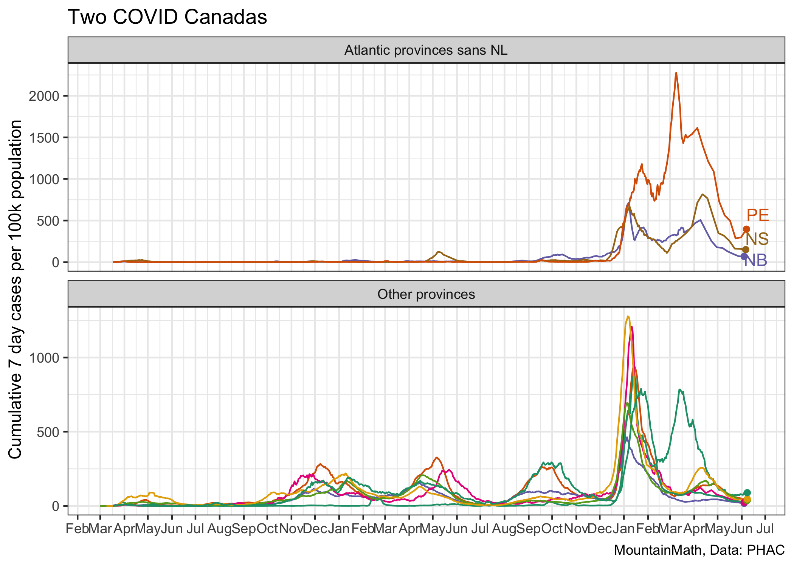

Two Covid Canadas
================
Jens von Bergmann
Last updated at 15 December, 2020 - 17:44

This notebook shows the confirmed COVID cases for Canadian provinces.
The code for this notebook is [available for anyone to adapt and use for
their own
purposes](https://github.com/mountainMath/BCCovidSnippets/blob/main/two_covid_canadas.Rmd).

The Atlantic provinces have pursued very different COVID-19 strategies
from the other provinces and have seen very different outcomes.

For better comparison we can plot the Atlantic provinces and the other
provinces on different scales.

