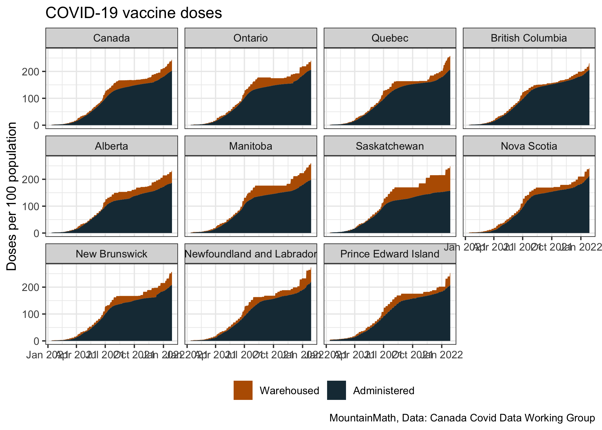
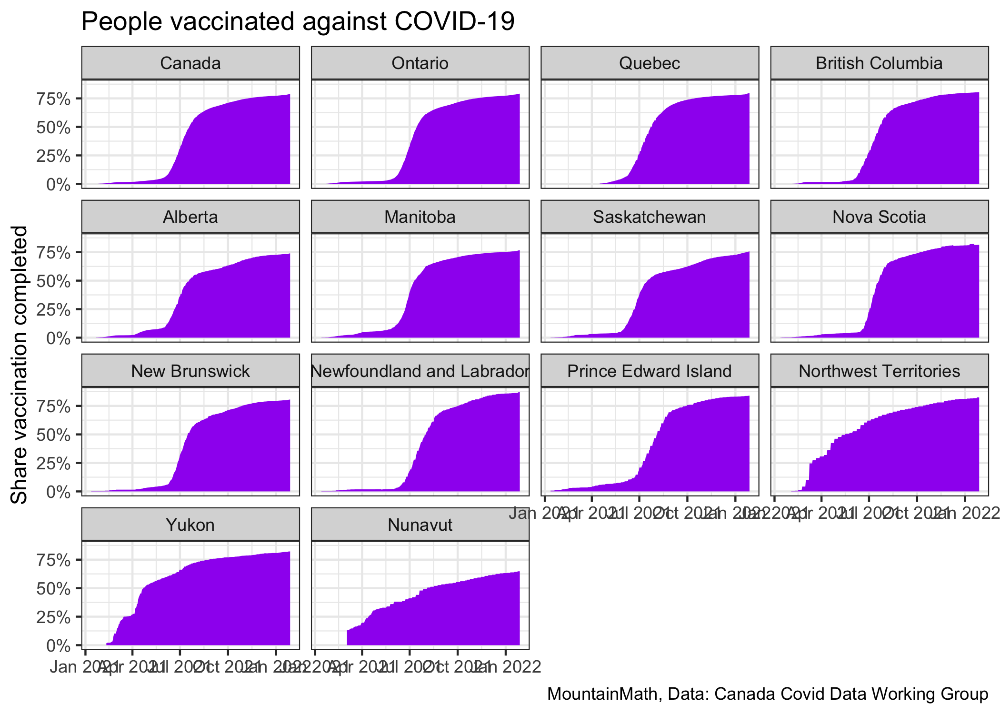
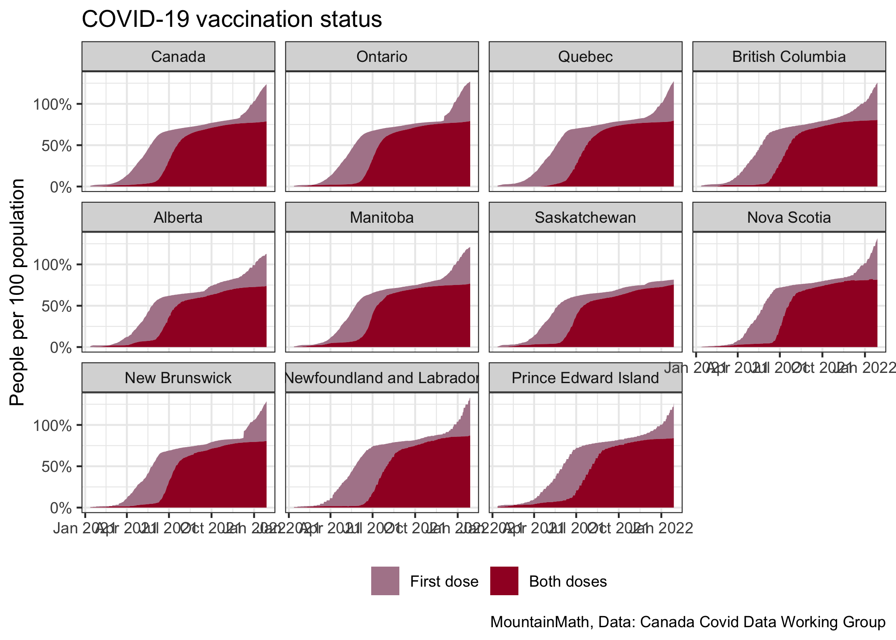
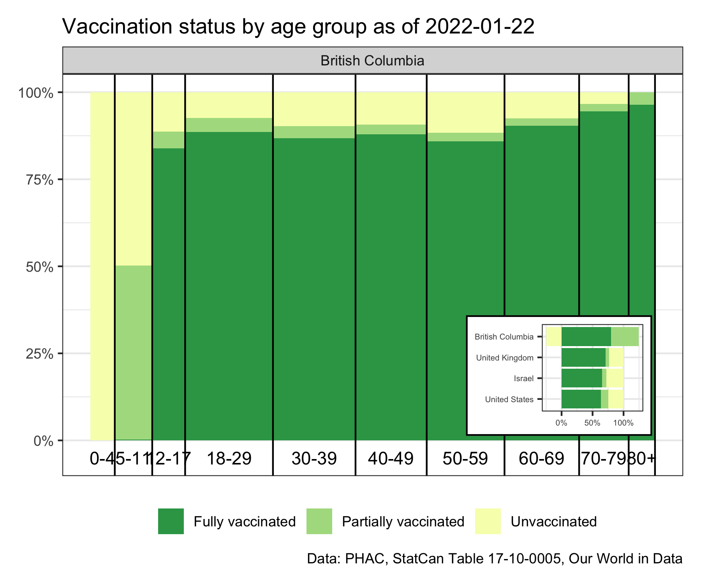

Vaccination Tracker
================
Jens von Bergmann
Last updated at 31 October, 2021 - 16:46

Vaccinations have arrived in Canada, and the [Canada COVID-19 Data
Working Group](https://opencovid.ca) is collecting data on vaccinations.

The first round of vaccines Canada got is the mRNA vaccine from BioNTech
that requires two doses, spaced 21 days apart, to be fully (\~95%)
effective, with the Moderna vaccine coming soon with similar
requirements with the second dose administered after 28 days. Moreover,
people are only considered vaccinated one week after having received the
second vaccine. So it takes about a month from getting the first shot
until a person is considered vaccinated.

## How to use the vaccine

There are two basic ways how local Health Authorities can utilize the
vaccine.

1.  The first approach is to think of vaccines as an extra layer of
    protection and as saving lives. This approach would aim to keep
    current COVID-19 spread low irrespective of vaccines and see
    vaccines as an add-on until we reach acceptable levels of herd
    immunity. Herd immunity is generally pegged at around 70% of people
    immune to COVID-19, which translates to a similar share of the
    population being vaccinated. Herd immunity does not guarantee
    localized outbreaks though, especially given the overdispersed
    nature of COVID-19, so it will be important to have some level of
    distancing in place even past the herd immunity threshold. The goal
    of this approach is CovidZero, with vaccines protecting vulnerable
    populations, as well as helping to get to Zero via decreasing the
    pool of susceptible people.
2.  The second approach would be to not focus on saving lives and
    morbidity but to keep these levels roughly constant and open up more
    instead.

The question of which approach to choose might seem like a question
about values, but economists have been pretty clear that the evidence
shows that reducing the spread of COVID-19 is the best way to open up
the economy and that the second approach is misguided. In the background
of all of this is the fact that it is not yet clear how robust the
vaccine is in handling mutations, which again points toward the first
approach being the only reasonable choice.

## Tracking vaccines

With vaccines coming in two doses we can track how doses are delivered
to provinces and administered to people. The first vaccine already gives
some protection, which is the reason some provinces have decided to
space out the period between the first and the second shot a little to
stretch the overall protective value of our currently scarce vaccine
supply.

From an immunization point of view it’s more important what share of the
population has recieved both vaccines and is considered immunized (with
95% efficacy a week after receiving the second shot).

The first does does grant some partial immunity, we can also look at the
share of the population that got both doses vs only the first dose of
the vaccine. This view might get more complicated once single-dose
vaccines become available in Canada.

If your goal is to use vaccinations to reduce deaths and morbidity, the
share of the population who received vaccinations gives a rough
indicator of the reduction a month from now when the vaccines take full
effect. Since vaccinations are initially focused on vulnerable
populations, the effect will be significantly higher than the shown
percentage.

If your goal is to use vaccinations to keep deaths and morbidity roughly
constant and instead open up faster, the share gives a rough indicator
of by how much we can increase contacts a month from now when the
vaccines take full effect. Again, because vaccinations are initially
focused on vulnerable populations, we can probably increase contacts
significantly more without increasing deaths, although this will likely
have detrimental effects on morbidity. (If this sounds really cynical
and like a terrible idea, that’s probably because it is.)

## Age-specific vaccination progress

